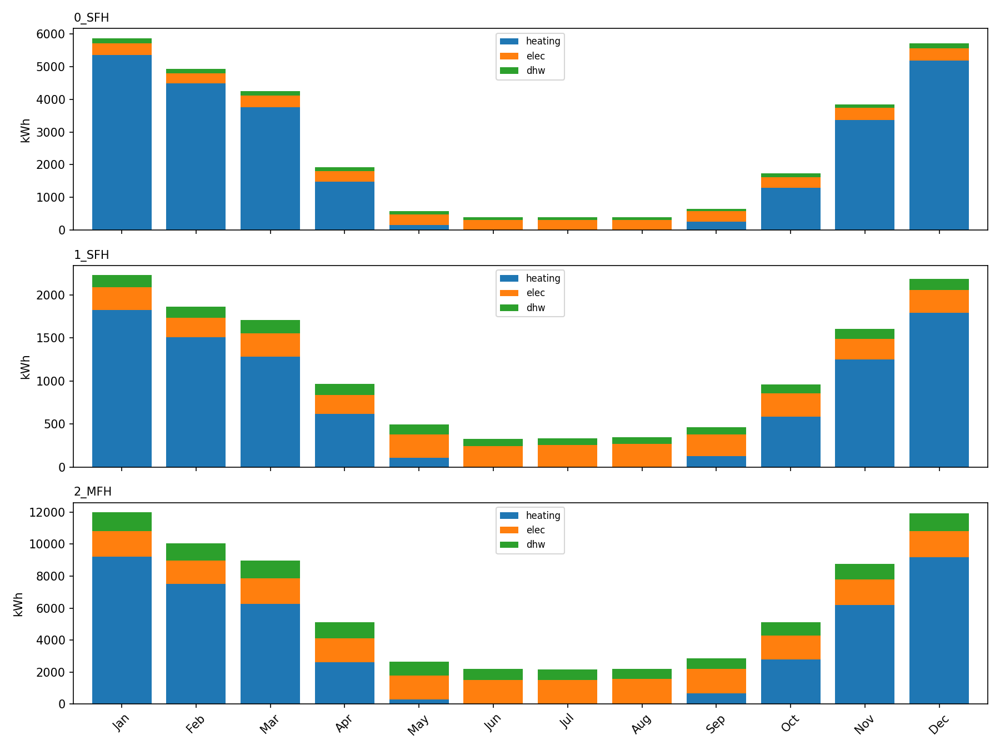
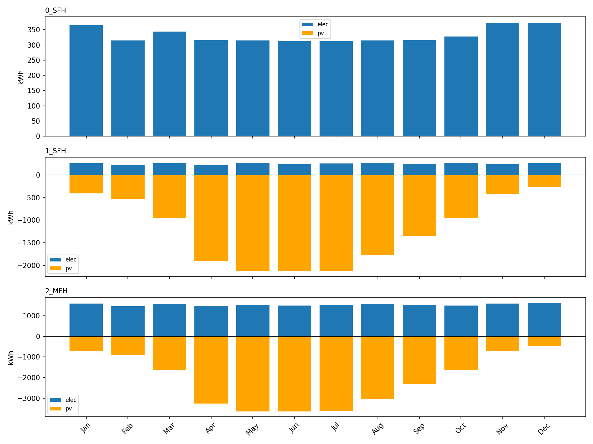
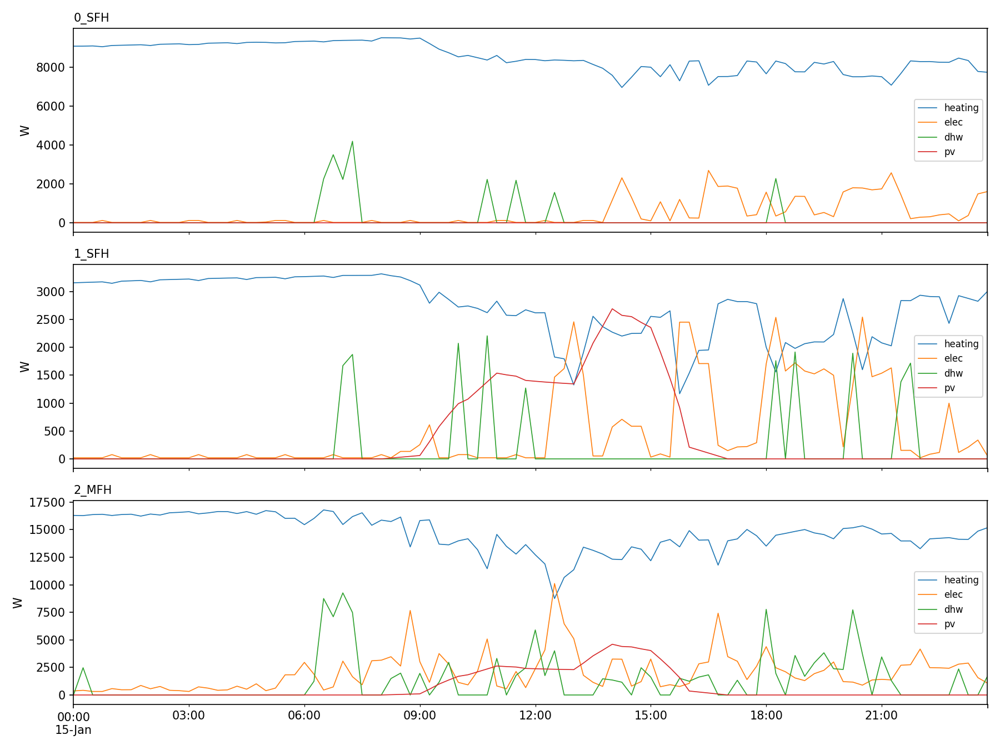

# Was das Werkzeug tut

**Profilgenerator**: aus wenigen Gebäudeattributen wird ein Jahr an zeitaufgelösten Profilen.

Eingabe pro Gebäude (CSV-Zeile): Typ, Baujahr, Sanierungsstand, Fläche,
Anlagentechnik, PV-Dachanteile.

Ausgabe pro Gebäude und Zeitschritt (alles in W):

| Größe | Spalte | Quelle im Ablauf |
|---|---|---|
| Strom (Geräte + Licht) | `elec` | richardsonpy |
| Raumwärme | `heating` | 5R1C / 7R2C |
| Trinkwarmwasser | `dhw` | OpenDHW |
| PV-Erzeugung | eigene Datei | `designDecentralDevices()` |

Dazu statisch: Normheizlast nach DIN EN 12831 (`heatload`), Bivalenzlast,
Wohnungs- und Bewohnerzahl.

Ablauf:

```
generateEnvironment()      TRY-Wetter aus PLZ -> DWD-Klimazone
initializeBuildings()      CSV-Zeile -> buildingFeatures
generateBuildings()        TEASER/TABULA -> Hülle; Users -> Wohnungen, Bewohner
generateDemands()          richardsonpy + OpenDHW + Thermomodell -> Profile
designDecentralDevices()   PV und Solarthermie
```

Wichtig: **PV läuft nicht in `generateDemands()`**, sondern im letzten Schritt und ist unabhängig von dem Gebrauch. Ein Solver wird für keinen dieser Schritte gebraucht.

---

# Generierte Szenarien

Drei Gebäude, so gewählt, dass jeweils genau ein Parameter
variiert wird. Zahlen aus einem Lauf: `my_district`, ZIP 10115, TRY2015 Jahr, TIMERESOLUTION=900, THERMAL_MODEL_TYPE=7R2C, SEED=1234.


| id | Typ | Baujahr | Retrofit | Fläche | PV (f_PV1/f_PV2) |
|---|---|---|---|---|---|
| 0 | SFH | 1975 | 0 (Bestand) | 150 m² | 0 / 0 |
| 1 | SFH | 1975 | 2 (KfW-55) | 150 m² | 0,3 / 0,3 |
| 2 | MFH | 1995 | 0 | 600 m², 8 WE | 0,4 / 0,4 |

Jahressummen aus dem Lauf:

| id | Heizung | TWW | Strom | PV | Heizlast |
|---|---|---|---|---|---|
| 0 SFH | 25.338 kWh | 1.348 kWh | 3.982 kWh | — | 12,0 kW |
| 1 SFH | 9.101 kWh | 1.344 kWh | 3.042 kWh | 14.929 kWh | 5,0 kW |
| 2 MFH | 44.775 kWh | 10.742 kWh | 18.475 kWh | 25.560 kWh | 25,2 kW |

Die drei Aussagen, die man daraus zeigen kann:

1. **Sanierung** (id 0 vs 1): Heizwärme sinkt um Faktor 3, Heizlast von 12 auf
   5 kW. Strom und TWW bleiben praktisch gleich — sie hängen an den Bewohnern,
   nicht an der Hülle.
2. **Gebäudetyp** (id 1 vs 2): TWW skaliert mit der Bewohnerzahl (8 statt 1
   Wohnung), nicht mit der Fläche.
3. **Saisonalität**: Wärme konzentriert sich auf Okt–Apr, PV auf Apr–Aug. Die
   Grafik `--plot balance` zeigt genau diese Gegenläufigkeit.



```bash
python plot_district.py --scenario my_district --plot energy --freq ME
```


```bash
python plot_district.py --scenario my_district --plot balance --cols elec,pv --freq ME
```

```bash
python plot_district.py --scenario my_district --plot profiles --cols heating,elec,dhw,pv --start 2015-01-15 --end 2015-01-15
```

---

# Einstellbare Parameter

**Pro Gebäude, in der Szenario-CSV:**

| Spalte | Wirkung |
|---|---|
| `building` | SFH, MFH, TH, AB (+ Nichtwohngebäude) |
| `year`, `retrofit` | wählt den TABULA-Archetyp; stärkster Hebel auf die Heizwärme |
| `area` | Nettogrundfläche; skaliert Hülle und (bei MFH/AB) Wohnungszahl |
| `construction_type` | thermische Masse |
| `night_setback` | Nachtabsenkung an/aus |
| `cooling` | aktive Kühlung an/aus |
| `f_PV1`, `f_PV2`, `gamma_PV` | Dachanteile beider Dachseiten und Azimut von Seite 1 |
| `f_STC` | Dachanteil Solarthermie |
| `EV`, `ev_charging` | E-Auto-Anteil und Ladeverhalten |

**Global, in `.env.CONFIG.<NAME>`:**

| Parameter | Wirkung |
|---|---|
| `ZIP` | Standort → DWD-Klimazone → Wetterdatensatz |
| `TRYYEAR`, `TRYTYPE` | TRY2015/TRY2045, Jahr/Somm/Wint |
| `TIMERESOLUTION` | 3600 / 1800 / 900 s |
| `THERMAL_MODEL_TYPE` | 5R1C oder 7R2C |
| `T_SET_MIN`, `T_SET_MIN_NIGHT`, `T_SET_MAX` | Solltemperaturen (20 / 18 / 23 °C) |
| `VENTILATION_RATE` | Luftwechsel, 0,5 1/h; geht linear in die Lüftungsverluste |
| `HEATING_PERIOD_START/END` | Heizperiode als Julianische Tage |
| `D_PV__*` | Wirkungsgrad 0,199, Temperaturkoeffizient, 9 Verlustfaktoren |

**Nicht per Konfiguration einstellbar, nur per Code-Eingriff:**

- Wohnungszahl und Bewohner pro Wohnung — werden gewürfelt. Unser
  `run_district.py` überschreibt beides (`FLAT_AREA`, `OCCUPANTS`).
  Bewohner sind hart auf 1..5 begrenzt.
- Dachneigung: in `datahandler.py` fest auf 35° verdrahtet.
- Wohnungen innerhalb eines Gebäudes haben immer dieselbe Fläche.
- Ein Gebäude ist genau **eine** Thermozone: ein Wärmeprofil je Gebäude,
  unabhängig von der Wohnungszahl.

Ohne Wirkung auf die Profile: die Spalte `heater`. Sie wird erst in der
Optimierung gebraucht.

---

# Wie wird gerechnet

| Deterministic | Stochastic |
|---|---|
| Wetter (Ortsgenaue TRY, BBSR 2020 / DWD) | Wohnungszahl (Zensus-2022-Verteilung) |
| Gebäudehülle, U-Werte, Flächen (TEASER (Remmen et al. 2018) mit TABULA/IWU (Loga et al. 2015)) | Bewohner je Wohnung |
| Normheizlast (DIN EN 12831-1:2017-09, DIN/TS 12831-1) | Jahresstrom je Wohnung (Stromspiegel-Band) |
| Raumwärme stündlich (DIN EN ISO 13790:2008-09 (5R1C) / VDI 6007 (7R2C)) | Geräteschaltungen, Beleuchtung (richardsonpy) |
| Interne Gewinne (Elsland et al. 2014: 70 W/Person, 80 % Licht, 66 % Geräte) | TWW-Zapfereignisse (OpenDHW) |
| PV und STC | Fahrzeugsegment, Batteriegröße, Tagesstrecke |

**Weitere Grenzen, die man nennen sollte:**

- Archetypen, keine realen Gebäude — geeignet für repräsentative Analysen.
- Eine Thermozone je Gebäude, keine wohnungsscharfen Wärmeprofile.
- Ein Wetterjahr; `TRYTYPE=Somm`/`Wint` liefert Extremvarianten für
  Robustheitsprüfungen.
- Kein Netzmodell auf der Bedarfsseite, nur ein Anschlusspunkt mit optionaler
  Leistungsgrenze.
- Für belastbare Vergleiche mehrere Ziehungen rechnen und die
Streuung angeben. Die Bibliothek setzt selbst keinen Seed, deswegen muss `random.seed()` vor `generateBuildings()` gesetzt werden. (Achtung aktuell beeinflusst es Wohnungen, Bewohner und Jahresverbräuche)
